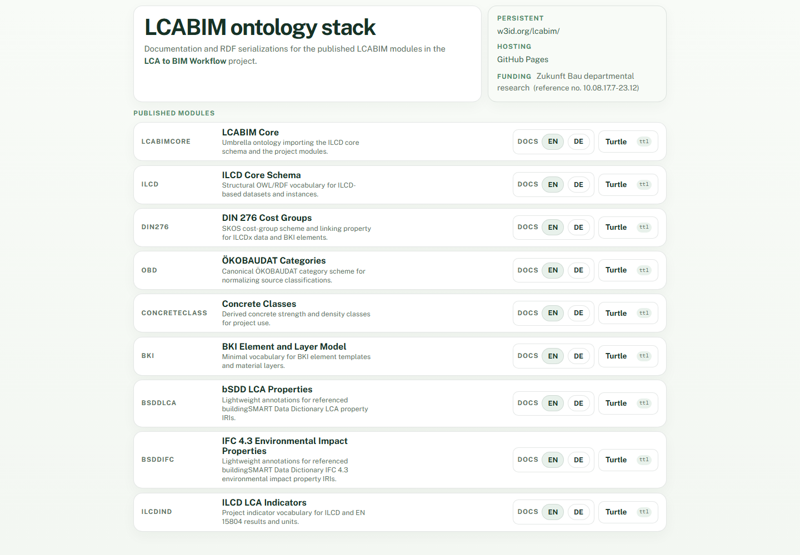
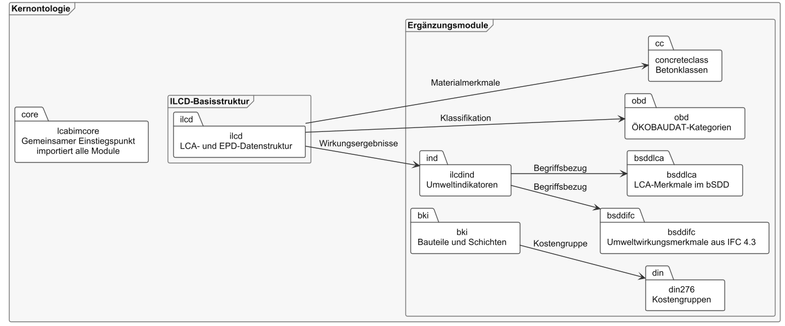

# LCABIM Ontology

This repository is a project page for my work developing and publishing the **LCABIM ontology stack** as part of the [LCA to BIM Workflow project](https://dc.rwth-aachen.de/lca-to-bim-workflow/) at Design Computation, RWTH Aachen University.

LCABIM connects life-cycle assessment data and building information modelling through a modular Linked Data vocabulary. The published stack covers the LCABIM core, ILCD, DIN 276, ÖKOBAUDAT, concrete classes, BKI elements and layers, bSDD/IFC environmental properties, and LCA indicators. It provides the semantic foundation for the [LCA BIM for Bonsai prototype](https://github.com/g3rezz/bimlca-bonsai-plugin), where these links support structured search across harmonized LCA and EPD data from within a BIM workflow.

*The [LCABIM ontology website](https://design-computation-rwth.github.io/lcabim-ontology/) provides English and German documentation and RDF/Turtle resources for each published module.*

## How the ontology connects LCA and BIM

*The LCABIM core imports the ILCD-based LCA and EPD structure and connects it to domain modules for material classes, ÖKOBAUDAT categories, environmental indicators, BKI elements and layers, DIN 276 cost groups, and LCA/IFC properties in the buildingSMART Data Dictionary. These shared semantic reference points make heterogeneous datasets consistently searchable and reusable in BIM applications.*

## Project links

- **LCA to BIM Workflow project:** [Design Computation, RWTH Aachen University](https://dc.rwth-aachen.de/lca-to-bim-workflow/)
- **Documentation and ontology browser:** [LCABIM documentation](https://design-computation-rwth.github.io/lcabim-ontology/)
- **Persistent namespace and RDF resources:** [w3id.org/lcabim](https://w3id.org/lcabim/)
- **Official source repository:** [Design-Computation-RWTH/lcabim-ontology](https://github.com/Design-Computation-RWTH/lcabim-ontology)
- **Bonsai reference implementation:** [g3rezz/bimlca-bonsai-plugin](https://github.com/g3rezz/bimlca-bonsai-plugin)

The authoritative repository is maintained by Design Computation at RWTH Aachen University. This personal GitHub repository intentionally contains only this project overview so the ontology, generated documentation, and development history remain in one canonical location.

## Published modules

- LCABIM Core
- ILCD core schema
- DIN 276 cost groups
- ÖKOBAUDAT categories
- Concrete classes
- BKI element and layer model
- bSDD LCA properties
- IFC 4.3 environmental-impact properties
- ILCD LCA indicators

The module documentation is generated with WIDOCO and published in English and German.
